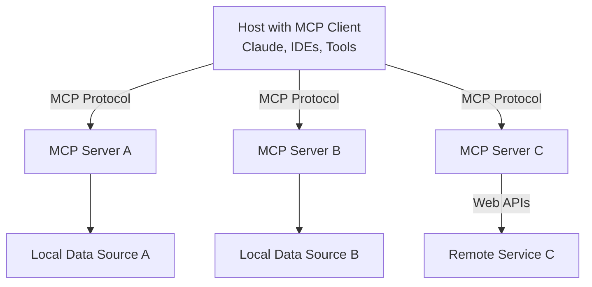

# Model Context Protocol (MCP) Docker Client-Server Example

## Introduction

The Model Context Protocol (MCP) is an open protocol that standardizes how applications provide context to Large Language Models (LLMs). Think of MCP like a USB-C port for AI applications - just as USB-C provides a standardized way to connect devices to peripherals, MCP provides a standardized way to connect AI models to different data sources and tools.

## Why MCP?

MCP helps you build agents and complex workflows on top of LLMs by:
- Providing a growing list of pre-built integrations for LLMs
- Offering flexibility to switch between LLM providers and vendors
- Implementing best practices for securing data within your infrastructure

## Architecture Diagram



## Project Structure
# 1-mcp-template-starter

This branch is intented to implement a barebones mcp server and client to serve as a template.

- `client/`: Contains the MCP client implementation
  - `client.py`: Demonstrates connecting to an MCP server and listing/calling tools
  - `Dockerfile`: Containerization for the client
  - `requirements.txt`: Python dependencies

- `server/`: Contains the MCP server implementation
  - `fastmcp.py`: Implements a simple MCP server with a hello_world tool
  - `Dockerfile`: Containerization for the server
  - `requirements.txt`: Python dependencies

- `docker-compose.yml`: Defines the multi-container Docker application

## Prerequisites

- Docker
- Docker Compose
- Python 3.8+

## Getting Started

### Installation

1. Clone the repository:
   ```bash
   git clone https://github.com/your-org/mcp-docker-example.git
   cd mcp-docker-example
   ```

### Running the Application

#### Using Docker Compose

1. Build and start the containers:
   ```bash
   docker compose up --build
   ```

   This command will:
   - Build the server and client Docker images
   - Start the containers
   - Connect the server and client via the MCP network

2. View the client logs to see the interaction:
   ```bash
   docker compose logs client
   ```

#### Stopping the Application

To stop and remove the containers:
```bash
docker compose down
```

## Example Interaction

When you run the application, the client will:
1. Connect to the MCP server
2. List available tools
3. Call the `hello_world` tool
4. Print the result

Expected output will include:
- Connection details
- List of available tools
- Result of the `hello_world` tool call

## Example Tool

The example includes a simple `hello_world` tool that demonstrates basic MCP functionality:

```python
@mcp.tool()
async def hello_world(name: str = "World") -> str:
    """Say hello to someone
    
    Args:
        name: The name of the person to greet
    """
    return f"Hello, {name}!"
```

## Troubleshooting

- Ensure Docker and Docker Compose are installed correctly
- Check that ports 3000/3001 are not in use by other services
- Verify network connectivity between containers

## Contributing

Contributions are welcome! Please feel free to submit a Pull Request.

## License

[Add your license information here]
